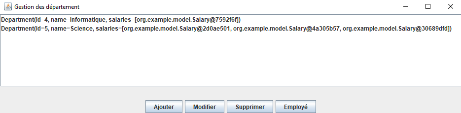
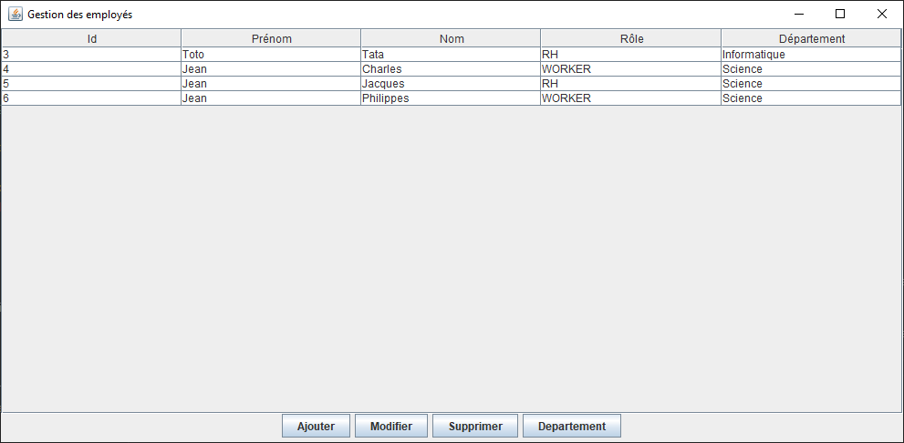

# Projet de Gestion des Départements et des Employés

Ce projet est une application Java Swing développée dans le cadre d'un projet étudiant. L'application permet de gérer des départements et des employés, chaque employé étant associé à un département, et chaque département pouvant contenir plusieurs employés. Les informations sont stockées dans une base de données SQL.

## Fonctionnalités

### Gestion des Départements

- **Ajouter** : Ajout d'un nouveau département
- **Modifier** : Modification des informations d'un département existant
- **Supprimer** : Suppression d'un département
- **Employés** : Affichage et gestion des employés d'un département

### Gestion des Employés

- **Ajouter** : Ajout d'un nouvel employé
- **Modifier** : Modification des informations d'un employé existant
- **Supprimer** : Suppression d'un employé
- **Département** : Affichage et gestion du département associé à un employé

## Structure de l'Interface

L'application se compose de deux pages principales :

- **Page de Gestion des Départements** : Pour ajouter, modifier, supprimer des départements et voir les employés d'un département.
  

- **Page de Gestion des Employés** : Pour ajouter, modifier, supprimer des employés et voir le département associé à chaque employé.
  

## Base de Données

Les données sont stockées dans une base de données SQL, avec les tables suivantes :

### Table `departments`

| Colonne | Type    | Description        |
| ------- | ------- | ------------------ |
| `id`    | INT     | Identifiant unique |
| `name`  | VARCHAR | Nom du département |

### Table `employees`

| Colonne         | Type    | Description                |
| --------------- | ------- | -------------------------- |
| `id`            | INT     | Identifiant unique         |
| `firstname`     | VARCHAR | Prénom de l'employé        |
| `lastname`      | VARCHAR | Nom de l'employé           |
| `role`          | VARCHAR | Poste de l'employé         |
| `department_id` | INT     | Identifiant du département |

## Prérequis

- Java 8 ou supérieur
- MySQL ou une autre base de données SQL

## Installation

1. Clonez le dépôt : `git clone https://github.com/AurelienBoets/swing_department.git`
2. Créez la base de données `swing_department` dans MySQL
3. Configurez les informations de connexion à la base de données dans le fichier dans `src/main/resources/hibernate.properties`
4. Compilez et exécutez l'application avec un IDE Java ou via la ligne de commande

## Utilisation

1. Lancez l'application.
2. Utilisez les boutons pour ajouter, modifier ou supprimer des départements et des employés.
3. Les modifications sont automatiquement sauvegardées dans la base de données.
